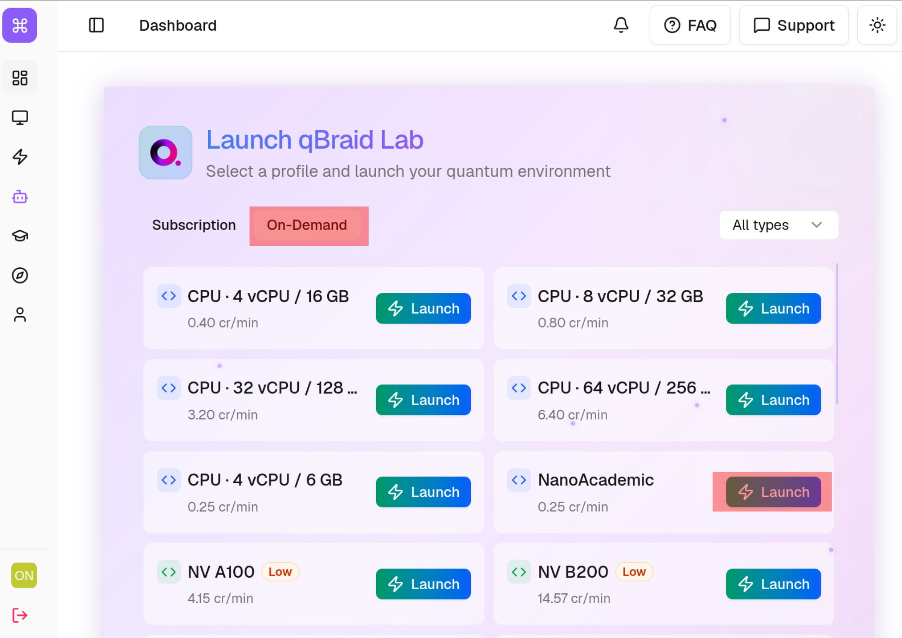

# 

**[Nanoacademic Technologies](https://www.nanoacademic.com/)** builds first-principles simulation software for materials, nanoelectronics, and quantum-device research. The Nanoacademic environment for [qBraid Lab](https://www.qbraid.com/) provides:

- **[RESCU](#rescu)** — large-scale real-space density functional theory.
- **[NanoDCAL](#nanodcal)** — first-principles quantum transport with NEGF-DFT.
- **[LatticeMind](#latticemind)** — an agentic AI assistant that builds and validates RESCU workflows.

All three are distributed as Python packages and installed into a qBraid environment. Start with [Setup](#setup).

---

## Setup

Four steps, done once per Lab. Steps 2 and 4 are the only ones that take real time.

### 1. Launch a qBraid Lab

Sign in to the [qBraid dashboard](https://www.qbraid.com/) and launch a Lab instance.



### 2. Install the Nanoacademic environment

In Lab, open the **Environments** panel, find **Nanoacademic**, and click **Install**. qBraid builds the environment from a pinned requirements file:

```
nanoacademic-atomistics-cli   command-line tool: licenses, MATLAB Runtime, sessions
rescu                         DFT solver
nanodcal                      quantum transport solver
lattice-mind                  AI assistant
```

<!-- TODO: screenshot of the Environments panel entry -->

Activate the environment, then select its kernel in any notebook you open. The rest of this guide assumes commands are run in a Lab terminal with the environment active.

Verify:

```bash
nano-cli --help
```

### 3. Sign in and download your licenses

RESCU, NanoDCAL, and LatticeMind each require a valid Nanoacademic license. Create an account and activate your licenses at [portal.nanoacademic.com](https://portal.nanoacademic.com/), then pull them into the Lab:

```bash
nano-cli session login
nano-cli licenses download --product rescu
nano-cli licenses download --product nanodcal
```

Licenses are written to `~/.nanoacademic/RESCU/license.lic` and `~/.nanoacademic/NANODCAL/license.lic`, which persists across Lab sessions. Confirm with:

```bash
nano-cli licenses path --product rescu
```

> License import through qBraid Vault is planned; today the CLI is the supported path.

### 4. Install the MATLAB Runtime

RESCU and NanoDCAL are MATLAB Compiler applications and need the MATLAB Runtime. It is licensed by MathWorks and downloaded directly from them — Nanoacademic ships none of it — so it is installed on first use rather than baked into the environment:

```bash
nano-cli runtime install --accept-license
```

This downloads roughly 2.8 GB and needs about 6 GB of free space in your Lab storage. It runs once; the Runtime persists with your account. `--accept-license` is your explicit acceptance of the MathWorks license, which is never assumed on your behalf.

If you skip this step, `rescu` and `nanodcal` detect the missing Runtime on first run and print the command to install it.

Verify:

```bash
nano-cli runtime status
```

### 5. Run something

```bash
python -c "import rescu, pathlib; print(pathlib.Path(rescu.__file__).parent / 'examples')"
cd "$(python -c "import rescu, pathlib; print(pathlib.Path(rescu.__file__).parent / 'examples')")"
rescu -i scf.input
```

A successful self-consistent-field run confirms the license, the Runtime, and the solver are all in place.

### Troubleshooting

| Symptom | Cause and fix |
| --- | --- |
| `nano-cli: command not found` | The environment is not active in this terminal. Activate it from the Environments panel. |
| Solver reports a missing or invalid license | Run `nano-cli licenses path --product <rescu\|nanodcal>`; re-run `nano-cli licenses download` if the file is absent. Check that the license is activated in the portal. |
| Fatal error loading a MATLAB library | The Runtime is missing or incomplete. Run `nano-cli runtime status`, then `nano-cli runtime install --accept-license`. |
| Runtime install fails partway | Almost always disk space. Free space in your Lab storage and re-run; the installer is safe to repeat. |

---

## <a id="rescu"></a>

**Large-scale density functional theory**

RESCU (Real-space Electronic Structure CalcUlator) is a Kohn-Sham DFT package designed to reach the length scales where realistic materials physics happens. Where conventional DFT codes become impractical at a few hundred atoms, RESCU stays productive from thousands to tens of thousands of atoms — the regime needed for defects, interfaces, heterostructures, and nanoscale devices.

It combines three representations of the electronic problem: a real-space grid, a basis of numerical atomic orbitals (NAO), and Chebyshev-filtered subspace iteration. This keeps the most demanding operations local and highly parallel. Scaling is roughly O(N^2.3) on a real-space grid from a few hundred to more than 5,000 atoms, and comparable or better in an NAO basis up to about 14,000 atoms, where the reduced memory footprint is often the deciding factor.

### Capabilities

| Category | Details |
| --- | --- |
| Levels of theory | LDA, GGA (including PBE), meta-GGA, Hartree-Fock exchange, hybrid functionals; more via LibXC |
| Magnetism and relativity | Spin-degenerate, collinear, and non-collinear spin, with spin-orbit coupling |
| Pseudopotentials | Norm-conserving (ONCV, Troullier-Martins) with partial core corrections, for LDA and GGA |
| Electronic structure | Total energy, ground-state density, band structure |
| Spectroscopy | DOS, PDOS, LDOS, PLDOS, Mulliken charges |
| Forces and geometry | Atomic forces, stress tensors, structural relaxation |
| Vibrational | Frozen-phonon spectra, dynamical matrices, interatomic force constants |
| Response | Dielectric permittivity, Raman spectra |
| HPC | MPI and OpenMP parallelism, built on FFTW and ScaLAPACK |

### Tutorials

The full tutorial catalog is maintained at [docs.nanoacademic.com/rescu/tutorials](https://docs.nanoacademic.com/rescu/tutorials/tutorials/) and covers:

- **Foundations** — numerical convergence (start here), equation of state, structure relaxation.
- **Electronic structure** — band structure, density of states, band unfolding, Mulliken charges.
- **Correlated and magnetic systems** — spin-DFT with spin-orbit coupling, DFT+U, hybrid functionals.
- **Topology and localization** — Berry curvature, maximally localized Wannier functions.
- **Surfaces and interfaces** — band offsets, adsorption energy, STM imaging (Tersoff-Hamann and Bardeen).
- **Vibrational** — finite-displacement phonons.

The how-to guides go further into bulk silicon, graphene PDOS, the chemical potential, the valence band maximum, the dielectric constant, the diamond vacancy, phosphorus doping in silicon, and DFPT response properties.

### Practical notes

- **Convergence.** If the SCF loop struggles, refine the real-space grid spacing and revisit smearing and mixing before changing anything else.
- **Memory.** Prefer the NAO basis for the largest structures.
- **Performance.** Scale the number of MPI processes to the size of the system.

Documentation: [docs.nanoacademic.com/rescu](https://docs.nanoacademic.com/rescu/)

---

## <a id="nanodcal"></a>

**Quantum transport from first principles**

NanoDCAL (Nanoacademic Device Calculator) is an atomic-orbital implementation of NEGF-DFT: density functional theory coupled with the Keldysh non-equilibrium Green's function formalism. That combination makes it a device simulator rather than a bulk-structure tool. It computes current, conductance, and transmission for open systems under finite bias, with the non-equilibrium quantum statistics that govern a working device.

DFT supplies the Hamiltonian of the nanostructure with full atomic detail; NEGF supplies the non-equilibrium occupation. The two are solved self-consistently, so charge density, electrostatic potential, and transport properties stay mutually consistent at every applied voltage.

This extends naturally to superconducting quantum computing: a Josephson junction is structurally a metal-insulator-metal device, the two-probe geometry NanoDCAL is built around. Oxidation, stoichiometry, and interface disorder in the tunnel barrier can be studied before a device is fabricated.

### Device types

| Configuration | Use case |
| --- | --- |
| 0-probe | Isolated molecules and periodic crystals via supercells |
| 1-probe | Surfaces with semi-infinite geometry |
| 2-probe | Open device structures with leads (the primary use case) |
| Multi-probe | Structures with several electrodes |

Leads can be one-, two-, or three-dimensional. Device structures of up to roughly 1,000 atoms are supported.

### Capabilities

- **Transport** — transmission coefficients, conductance and resistance, nonlinear non-equilibrium I-V characteristics.
- **Electronic structure** — total and local density of states, band structure, current density, scattering states.
- **Spin** — spin-polarized transport, collinear and non-collinear, with spin-orbit coupling.
- **Forces and vibrations** — atomic forces, structural optimization, vibrational properties including electron-phonon coupling.
- **Beyond DC** — photocurrent, thermal and thermoelectric transport, self-consistent gate fields for leads with finite cross-section, and AC voltages on top of a DC bias (experimental).

### Tutorials

The full catalog is at [docs.nanoacademic.com/nanodcal/tutorials](https://docs.nanoacademic.com/nanodcal/tutorials/):

1. **Electronic structure** — fat-band structure of a PtSe2 monolayer.
2. **Molecular electronics** — simple molecular devices and their dynamic (AC) conductance; the core two-probe workflow from self-consistency to transmission and I-V.
3. **Spin devices** — zigzag graphene nanoribbons, a nickel-graphene interface, and DFT+U.
4. **Semiconductor devices** — spin-orbit interaction, carrier effective mass, complex band structure.
5. **2D materials** — a WSe2 monolayer device.
6. **Photodetectors** — photocurrent in an illuminated WSe2 monolayer.
7. **Phonons and thermoelectrics** — frozen phonons, thermoelectric properties, thermoelectric transport.

### Practical notes

- **Leads.** Converge the lead (electrode) cell as a periodic bulk calculation before assembling the two-probe device; the leads define the boundary conditions.
- **Bias and integration.** For non-equilibrium runs, check convergence of the current against the energy and bias-window integration grids.
- **Self-consistency.** If a biased calculation converges slowly, start from the converged zero-bias solution and ramp the voltage gradually.

Documentation: [docs.nanoacademic.com/nanodcal](https://docs.nanoacademic.com/nanodcal/)

---

## <a id="latticemind"></a>

**Agentic AI for first-principles simulation**

LatticeMind turns a natural-language request — "compute the band structure of zinc-blende GaAs", "set up a DFPT phonon workflow for fcc aluminum" — into a complete, physically consistent, ready-to-run simulation. It pairs a large language model with deterministic, physics-aware validation: every structure and every input file is checked against known physics and RESCU's documented input format before any compute time is spent.

It handles the tedious, error-prone parts of DFT setup — choosing a sensible cell, wiring multi-step dependencies, picking pseudopotentials, conforming to the input schema — while keeping you in control through explicit review, cost, and launch-approval steps.

### What it does

- **Natural-language workflow design.** Plain-English request to validated, solver-ready RESCU input decks, single or multi-step.
- **Validation-gated execution.** A typed workflow contract enforces step dependencies (reusing a saved density for DOS or band structure, for example), and a readiness and cost check runs before submission.
- **Self-healing.** When a step fails, LatticeMind diagnoses the cause and repairs and reruns that step rather than starting over.
- **Flexible execution.** Local, remote SSH workstation, or Slurm cluster. On qBraid, it dispatches to the Lab's CPU/GPU resources.
- **Durable projects.** Resume, fork, and continue past projects, with generated reports of inputs, outputs, and figures.

LatticeMind targets RESCU today. Support for VASP and for quantum transport with NanoDCAL is in active development.

### Supported workflows

| Category | What LatticeMind sets up |
| --- | --- |
| Total energy and SCF | Self-consistent ground state, total energy, charge density |
| Electronic band structure | Bands along standard high-symmetry paths |
| Density of states | DOS and projected DOS |
| Convergence and equation of state | k-point convergence scans, equation-of-state and lattice-constant studies |
| Structural relaxation | Geometry optimization |
| Phonons | Γ-point DFPT phonon workflows |

Each family is exercised in a validation benchmark spanning covalent and ionic crystals, oxides, metals, and 2D/layered systems.

### Configure and run

LatticeMind needs an AI provider key in addition to its Nanoacademic license. Create a key at [platform.openai.com](https://platform.openai.com/api-keys), then store it:

```bash
nano-cli env openai-api-key --api-key "sk-..."
eval "$(nano-cli env export)"
```

Claude, Gemini, Qwen, and local models are also supported — set `RESCU_LLM_PROVIDER` and the matching key.

Start the interactive assistant:

```bash
latticemind
```

Or the web interface, served through the qBraid proxy:

```bash
latticemind-web --host 0.0.0.0 --port 7865 --no-open
```

Open `<notebook-base>/proxy/7865/`. **The trailing slash matters** — without it the dashboard renders as unstyled HTML.

Prompts to try:

> Build a two-step silicon workflow: SCF with a saved density, then DOS from that density.

> Create a two-step zinc-blende GaAs workflow: SCF with a saved density, then a band structure along the standard FCC path.

> Create a spin-polarized workflow for bcc iron: first a collinear spin SCF calculation, then a DOS calculation using the saved density. Use a reasonable initial magnetic setup for Fe.

Type `/examples` for more validated starter prompts, or `/commands` to see everything LatticeMind can do.

---

## Reference

- [Nanoacademic documentation](https://docs.nanoacademic.com/) — [RESCU](https://docs.nanoacademic.com/rescu/) · [NanoDCAL](https://docs.nanoacademic.com/nanodcal/)
- [Nanoacademic portal](https://portal.nanoacademic.com/) — accounts and licenses
- [qBraid documentation](https://docs.qbraid.com/)
- [nanoacademic.com](https://www.nanoacademic.com/)
