# 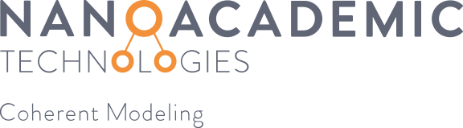

**[Nanoacademic Technologies](https://www.nanoacademic.com/)** provides first-principles simulation tools for materials, nanoelectronics, and quantum-device research. This qBraid Lab image includes:

- **[RESCU](#rescu):** large-scale real-space density functional theory.
- **[NanoDCAL](#nanodcal):** first-principles quantum transport with NEGF-DFT.
- **[LatticeMind](#latticemind):** an agentic AI assistant for building and validating RESCU workflows.

New here? The [Quick Start](#quick-start) walks you, step by step and with screenshots, from an empty qBraid account to your first calculation.

---

## <a id="rescu"></a>

Large-Scale Density Functional Theory


> A real-space Density Functional Theory (DFT) solver built to reach the length scales where realistic materials physics actually happens, from a single molecule to tens of thousands of atoms.

Welcome to RESCU on qBraid. This page gives you a quick sense of what RESCU can do and walks you through the bundled examples. The software and its example notebooks ship with the Nanoacademic environment, so once you have followed the [Quick Start](#quick-start) there is nothing left to install.

### Overview

RESCU (Real-space Electronic Structure CalcUlator) is a Kohn-Sham DFT package developed by Nanoacademic Technologies. It is engineered for one purpose above all: to compute the ground-state electronic structure of very large systems without forcing you to compromise on accuracy. Where conventional DFT codes become impractical at a few hundred atoms, RESCU is designed to stay productive well into the range of thousands to tens of thousands of atoms, which is the regime needed to model defects, interfaces, heterostructures, and nanoscale devices as they are built in the laboratory.

RESCU achieves this by combining three complementary representations of the electronic problem: a real-space grid, a basis of numerical atomic orbitals (NAO), and Chebyshev-filtered subspace iteration for systematic and memory-efficient convergence. This design keeps the most demanding operations local and highly parallel, which is what allows the method to scale.

### Why it matters

For many of the most interesting questions in materials science, size is not a detail, it is the physics. A point defect in a semiconductor, the moire pattern of a van der Waals stack, or the band alignment at a solid-liquid interface cannot be captured faithfully in a small unit cell. RESCU lets you keep the full atomistic detail of these systems while staying within reach of routine computing resources, so you can move from idealized models to structures that resemble real samples.

### Highlights

- **Levels of theory:** LDA, GGA (including PBE), and meta-GGA functionals, together with Hartree-Fock exchange and hybrid functionals. Additional functionals are available through the LibXC library.
- **Magnetism and relativity:** spin-degenerate, collinear, and non-collinear spin calculations, with spin-orbit coupling.
- **Pseudopotentials:** norm-conserving pseudopotentials, including Optimized Norm-Conserving Vanderbilt (ONCV) and Troullier-Martins constructions, with partial core corrections, supplied for LDA and GGA.
- **Basis and solvers:** real-space grid discretization and numerical atomic orbitals, accelerated by Chebyshev-filtered subspace iteration for large systems.
- **High-performance computing:** parallelized with MPI and OpenMP and built on optimized libraries (FFTW, ScaLAPACK). 

### What you can compute

| Category | Properties |
| --- | --- |
| Electronic structure | Total energy, ground-state density, band structure |
| Spectroscopy and analysis | Density of states (DOS), projected DOS (PDOS), local DOS (LDOS, PLDOS), Mulliken charges |
| Forces and geometry | Atomic forces, stress tensors, structural relaxation (steepest descent and conjugate gradient) |
| Vibrational properties | Frozen-phonon spectra, dynamical matrices, interatomic force constants |
| Optical and vibrational response | Dielectric permittivity, Raman spectra |

### Scalability at a glance

RESCU is built around favorable scaling rather than brute force. Using a real-space grid, it scales consistently as roughly O(N^2.3) from a few hundred atoms to more than 5,000 atoms, with comparable or better scaling in a numerical atomic orbital basis up to the 14,000-atom range. Representing wavefunctions as linear combinations of atomic orbitals significantly reduces the memory footprint, which is often the true bottleneck for large calculations.

### Hands-on examples

The qBraid environment ships with the full set of official RESCU tutorials as ready-to-run notebooks. The tutorials take you from convergence checks to your first analyses, while the how-to guides go further into electronic structure, defects, and doping; the conceptual and reference material is gathered under Getting Started. Each one is self-contained and annotated.

**Tutorials**

1. **Numerical convergence.** Check how the total energy and key quantities converge with the real-space grid, k-point sampling, and basis settings. *Start here:* it establishes trustworthy parameters before any production run.
2. **Equation of state and geometry optimization.** Fit the equation of state to obtain the equilibrium lattice constant and bulk modulus, and relax the cell.
3. **Structure relaxation.** Optimize the atomic positions to their equilibrium geometry.
4. **Band structure.** Compute the electronic bands along high-symmetry paths and project them onto atomic-orbital characters.
5. **Density of states.** Total, projected (PDOS), and local (LDOS) density of states.
6. **Band unfolding.** Recover an effective primitive-cell band structure from a supercell calculation.
7. **Mulliken charges.** Orbital-resolved population analysis.
8. **Spin-DFT.** Collinear and non-collinear magnetism, with spin-orbit coupling.
9. **DFT+U.** Correct on-site correlation for localized d and f states.
10. **Hybrid functionals.** Exact-exchange and hybrid calculations for improved band gaps.
11. **Berry curvature.** Geometric and topological properties of the band structure.
12. **Wannier functions.** Maximally localized Wannier functions.
13. **Phonons (finite displacement).** Vibrational spectra from frozen-phonon supercells.
14. **Band offsets.** Valence- and conduction-band-edge alignment across an interface.
15. **Adsorption energy.** Binding energy of an adsorbate on a surface.
16. **STM simulations (Tersoff-Hamann).** Scanning tunneling microscopy images using the Tersoff-Hamann approximation.
17. **STM simulations (Bardeen).** Scanning tunneling microscopy images using Bardeen's tunneling formalism.

**How-To Guides**

Going further, the how-to guides cover bulk silicon basics, graphene PDOS, the chemical potential, the valence band maximum, the dielectric constant, the diamond vacancy defect, phosphorus doping in silicon (including impurity-state analysis of the P-in-Si donor), and DFPT response properties.

### Getting started on qBraid

After completing [Quick Start](#quick-start), use these RESCU-specific steps:

1. **Open a notebook.** Start with the numerical convergence tutorial to confirm your setup and learn the input format.
2. **Run and visualize.** Execute the cells to compute the band structure and DOS, then use the built-in DOS, PDOS, LDOS, and band-structure tools to inspect the results.
3. **Make it yours.** Copy a notebook as a template, replace the structure, and adjust the functional, basis, and convergence settings to match your own system.

### Tips and troubleshooting

- **Convergence:** if the self-consistent loop struggles to converge, refine the real-space grid spacing and revisit the smearing and mixing parameters before changing anything else.
- **Memory on large systems:** prefer the numerical atomic orbital basis for the largest structures, since it reduces the memory footprint substantially.
- **Performance:** scale the number of MPI processes to the size of the system.

### Documentation and resources

- Official RESCU documentation: https://docs.nanoacademic.com/rescu/
- Tutorial catalog: https://docs.nanoacademic.com/rescu/tutorials/tutorials/
- Nanoacademic Technologies: https://nanoacademic.com/

---

## <a id="nanodcal"></a>

Quantum Transport from First Principles


> A quantum transport simulator that predicts how electrons flow through a device, from a single molecule between two electrodes to a sub-nanometer transistor, directly from first principles.

Welcome to NanoDCAL on qBraid. This page introduces what NanoDCAL computes and walks you through the bundled device examples. The software and its example notebooks ship with the Nanoacademic environment, so once you have followed the [Quick Start](#quick-start) there is nothing left to install.

### Overview

NanoDCAL (Nanoacademic Device Calculator) is a quantum transport package developed by Nanoacademic Technologies. It is an atomic-orbital implementation of the NEGF-DFT method, which couples Density Functional Theory (DFT) with the Keldysh non-equilibrium Green's function (NEGF) formalism. This combination is what makes NanoDCAL a genuine device simulator rather than a bulk-structure tool: it computes current, conductance, and transmission for open systems under a finite bias, accounting for the non-equilibrium quantum statistics that govern a working device.

The workflow is conceptually simple. DFT determines the Hamiltonian of the nanostructure with full atomic detail, while NEGF supplies the non-equilibrium statistical occupation through the Keldysh formalism. The two are solved self-consistently, so the charge density, the electrostatic potential, and the transport properties are mutually consistent at every applied voltage.

### Why it matters

Predicting the electronic structure of a material is only half the story for nanoelectronics. The question that ultimately matters is how a device behaves when it is connected to electrodes and a voltage is applied. NanoDCAL answers that question directly, providing current-voltage characteristics and transmission spectra that can be compared against experiment and used to evaluate device concepts before they are fabricated. For molecular electronics, spintronics, and ultra-scaled transistors, this is the difference between a structural model and a performance prediction.

The same reach extends to superconducting quantum computing, where qubit performance is shaped by materials as much as by design. The Josephson junction at the core of a qubit is, structurally, a metal-insulator-metal device, the two-probe geometry NanoDCAL is built around. NanoDCAL brings first-principles, atomic-scale modeling to that junction, so you can study how the tunnel barrier and its interfaces, from oxidation and stoichiometry to disorder, shape the junction's transport, and weigh material choices before a single device is fabricated.

### Device types

NanoDCAL is organized around the geometry of the problem, from closed systems to multi-terminal devices:

| Configuration | Use case |
| --- | --- |
| 0-probe | Isolated molecules and periodic crystals via supercells |
| 1-probe | Surfaces with semi-infinite geometry |
| 2-probe | Open device structures with leads (the primary use case) |
| Multi-probe | Structures with several electrodes |

Leads can be one-, two-, or three-dimensional, and the package handles device structures of up to roughly 1,000 atoms.

### What you can compute

- **Transport:** transmission coefficients, conductance and resistance, and nonlinear, non-equilibrium current-voltage (I-V) characteristics.
- **Electronic structure:** total and local density of states, band structure, current density, and scattering states.
- **Spin:** spin-polarized transport, with collinear and non-collinear treatments and spin-orbit coupling.
- **Forces and vibrations:** atomic forces, structural optimization, and vibrational properties including electron-phonon coupling.
- **Beyond DC:** photocurrent, thermal and thermoelectric transport, gate fields included self-consistently for leads with finite cross-section, and external AC voltages applied on top of a DC bias (experimental).

### Hands-on examples

The qBraid environment ships with the full set of official NanoDCAL tutorials as ready-to-run notebooks, organized by topic. Each one is self-contained and annotated.

1. **Electronic structure.** Compute the fat-band structure of a PtSe2 monolayer. *Key takeaway:* extracting orbital-resolved band structure from a first-principles calculation.
2. **Molecular electronics.** Build simple molecular devices and explore their dynamic (AC) conductance. *Key takeaway:* the core two-probe workflow, from self-consistency to transmission and the current-voltage curve.
3. **Spin devices.** Study spin-resolved transport in a zigzag graphene nanoribbon, a nickel-graphene interface, and with DFT+U. *Key takeaway:* resolving transport by spin channel for spintronics applications.
4. **Semiconductor devices.** Account for spin-orbit interaction, carrier effective mass, and complex energy band structure. *Key takeaway:* the ingredients needed for realistic semiconductor device modeling.
5. **2D materials.** Set up a WSe2 monolayer device. *Key takeaway:* applying the NEGF-DFT workflow to two-dimensional channels.
6. **Photodetectors.** Compute the photocurrent in a WSe2 monolayer under illumination. *Key takeaway:* predicting optoelectronic response from first principles.
7. **Phonons and thermoelectric properties.** Run a frozen phonon calculation (7.1), then evaluate the thermoelectric properties of materials (7.2) and thermoelectric transport (7.3). *Key takeaway:* assessing energy-conversion performance end to end, from lattice vibrations to transport.

### Getting started on qBraid

After completing [Quick Start](#quick-start), use these NanoDCAL-specific steps:

1. **Start small.** Open a basic tutorial, such as a simple molecular device or the PtSe2 electronic-structure example, to become familiar with the two-probe setup and the input format.
2. **Run the transport calculation.** Compute the self-consistent NEGF-DFT solution, then evaluate the transmission spectrum and the current-voltage characteristics.
3. **Make it yours.** Use an example as a template, substitute your structure and electrodes, and extend the analysis to spin, gating, or thermoelectric properties as needed.

### Tips and troubleshooting

- **Lead setup:** make sure the lead (electrode) cell is a well-converged, periodic bulk calculation before assembling the two-probe device, since the leads define the boundary conditions.
- **Bias and integration:** for non-equilibrium runs, check the convergence of the current with respect to the energy and bias-window integration grids.
- **Self-consistency:** if a biased calculation is slow to converge, start from the converged zero-bias solution and ramp the voltage gradually.

### Documentation and resources

- Official NanoDCAL documentation: https://docs.nanoacademic.com/nanodcal/
- Full tutorial catalog: https://docs.nanoacademic.com/nanodcal/tutorials/
- Nanoacademic Technologies: https://nanoacademic.com/

---

## <a id="latticemind"></a>

Agentic AI for First-Principles Simulation


> Describe the calculation you want in plain language, and LatticeMind designs, validates, and runs the workflow for you, turning a one-sentence request into solver-ready RESCU inputs and results.

Welcome to LatticeMind on qBraid. LatticeMind is Nanoacademic's agentic AI assistant for atomistic simulation. It ships with the Nanoacademic qBraid environment and can dispatch the RESCU calculations it builds to the CPU/GPU resources of qBraid Labs.

### Overview

LatticeMind turns a natural-language request, such as "compute the band structure of zinc-blende GaAs" or "set up a DFPT phonon workflow for fcc aluminum", into a complete, physically consistent, ready-to-run simulation. It pairs a large language model with deterministic, physics-aware validation so that the workflows it produces are not merely plausible but correct and executable. Every structure and every input file is checked against known physics and RESCU's documented input format before any computing time is spent.

The result is an assistant that handles the tedious, error-prone parts of DFT setup, choosing a sensible cell, wiring multi-step dependencies, picking pseudopotentials, and conforming to the input schema, while keeping you in control through explicit review, cost, and launch-approval steps.

### Why it matters

Configuring a first-principles calculation correctly takes expertise and care: the structure must be right, the workflow steps must hand off data in the correct order, the numerical settings must be converged, and every keyword must match the solver's exact format. A single mistake can waste hours of compute or, worse, produce a confidently wrong result. LatticeMind compresses that setup from hours to minutes and catches errors before submission, which lowers the barrier for newcomers while letting experienced users move much faster, without giving up oversight of the science.

### What it can do

- **Natural-language workflow design.** Go from a plain-English request to validated, solver-ready RESCU input decks for single or multi-step workflows.
- **Built on RESCU.** LatticeMind targets the RESCU DFT solver today. Support for VASP and for quantum transport with NanoDCAL is in active development.
- **Validation-gated execution.** A typed workflow contract enforces step dependencies (for example, reusing a saved density for DOS or band structure), and a pre-launch readiness and cost check runs before anything is submitted.
- **Self-healing.** When a calculation or input fails, LatticeMind diagnoses the cause and repairs and reruns the affected step rather than starting over.
- **Flexible execution.** Run locally, on a remote SSH workstation, or on a Slurm HPC cluster. On qBraid, dispatch to the lab's CPU/GPU resources.
- **Durable projects.** Resume, fork, and continue past projects, with automatically generated reports of inputs, outputs, and figures.

### What you can compute

These are the RESCU workflow families LatticeMind builds today. Each one is
exercised in our validation benchmark across a range of materials (covalent and
ionic crystals, oxides, metals, and 2D/layered systems).

| Category | What LatticeMind sets up |
| --- | --- |
| Total energy and SCF | Self-consistent ground state, total energy, and charge density |
| Electronic band structure | Band structure along standard high-symmetry paths |
| Density of states | Density of states (DOS) and projected DOS (PDOS) |
| Convergence and equation of state | k-point convergence scans and equation-of-state / lattice-constant studies |
| Structural relaxation | Geometry optimization |
| Phonons | Γ-point DFPT phonon workflows |

### How it works

1. **Understand.** LatticeMind interprets your request and asks a clarifying question only when something essential is genuinely ambiguous.
2. **Build the structure.** It sources or constructs the cell from authoritative data and verifies the geometry and composition.
3. **Plan the workflow.** It lays out the calculation steps as a typed contract with explicit data hand-offs.
4. **Generate and validate inputs.** It writes each input deck and checks it against the solver's documented format and physical sanity rules.
5. **Preview and launch.** It estimates cost and readiness, shows you exactly what will run, and launches only after approval.
6. **Post-process and report.** It extracts results, produces standard plots, and assembles a report.
7. **Recover.** If a step fails, it diagnoses and repairs rather than failing silently.

### Getting started on qBraid

The [Quick Start](#quick-start) leaves you with LatticeMind installed, licensed, and pointed at an AI provider. From there, three short steps get you to your first workflow.

1. **Create a project folder.** LatticeMind organizes work by project and will politely decline to run in your home directory, so give each calculation a home of its own:

   ```bash
   mkdir -p ~/latticemind_projects/si_scf
   cd ~/latticemind_projects/si_scf
   ```

2. **Start LatticeMind.** Run `latticemind` for the interactive terminal assistant. For the web interface, type `/web` once you are inside, or launch it directly through the qBraid proxy:

   ```bash
   latticemind-web
   ```

   Then open the qBraid proxy URL, which has the form `<notebook-base>/proxy/<port>/`. The default port is `7865`, so the URL should end with `/proxy/7865/`.

   The final slash matters. If you open `<notebook-base>/proxy/7865` without it, the LatticeMind dashboard can appear as unstyled plain HTML rather than the full web interface.

3. **Try a prompt.** Describe the calculation you want in plain language:

   > Build a two-step silicon workflow: SCF with a saved density, then DOS from that density.

   > Create a two-step zinc-blende GaAs workflow: SCF with a saved density, then a band structure along the standard FCC path.

   > Create a spin-polarized workflow for bcc iron: first a collinear spin SCF calculation, then a DOS calculation using the saved density. Use a reasonable initial magnetic setup for Fe.

   Type `/examples` for more validated starter prompts, `/commands` to browse everything LatticeMind can do, or `/help <topic>` when you want an explanation of a particular command.

### Choosing an AI provider<a id="choosing-an-ai-provider"></a>

The simplest route is an OpenAI key. Set it once through `nano-cli` (**Set OpenAI API Key**, as in Step 10 of the [Quick Start](#quick-start)), or export it yourself:

```bash
export OPENAI_API_KEY="sk-..."
```

Claude, Gemini, Qwen, and local models are supported as well. To switch, set `RESCU_LLM_PROVIDER` along with the matching API key for that provider.

### Keeping LatticeMind up to date

LatticeMind ships with the Nanoacademic environment, and new releases arrive regularly. To pull the latest version yourself, activate the environment and install from the Nanoacademic package index:

```bash
pip install --index-url https://pypi.nanoacademic.ca/simple/ --extra-index-url https://pypi.org/simple/ lattice-mind
```

Add `--upgrade` if LatticeMind is already installed and you want to move it to the newest release. The `--extra-index-url` is there so that ordinary dependencies still resolve from PyPI, so please keep both flags in place.

### Documentation and resources

- Official LatticeMind documentation: https://docs.nanoacademic.com/latticemind/
- RESCU documentation (the solver LatticeMind targets): https://docs.nanoacademic.com/rescu/
- Nanoacademic Technologies: https://nanoacademic.com/

---

## Quick Start

This walkthrough takes you from a fresh qBraid account to a working Nanoacademic setup, with RESCU, NanoDCAL, and LatticeMind ready to run. 

**Before you begin, it helps to have:**

- A [qBraid](https://www.qbraid.com/) account.
- A Nanoacademic account at [portal.nanoacademic.com](https://portal.nanoacademic.com/), with licenses activated for the products you plan to use. RESCU, NanoDCAL, and LatticeMind are licensed separately.
- Optionally, an OpenAI API key, if you would like to use LatticeMind (Step 10).

### Step 1. Launch a qBraid Lab instance

Sign in to the [qBraid dashboard](https://www.qbraid.com/) and find the **Launch qBraid Lab** panel. Pick the **Subscription** or **On-Demand** tab depending on your plan, then press **Launch** next to a profile. **Small (2 vCPU, 4 GB)** is plenty for this guide and for working through the tutorial notebooks.

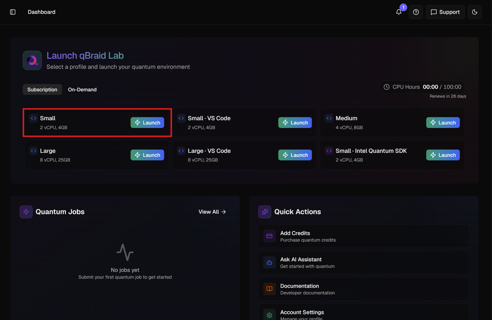

JupyterLab opens in a new tab. That is your Lab, and everything that follows happens inside it.

> **A note on sizing.** DFT is memory-hungry. Small is a good place to learn, but move up to Medium or Large once you start running production calculations.

### Step 2. Open the Environments panel

In qBraid Lab, open the **ENVIRONMENTS** panel from the icons at the top right (the stacked-layers icon), then click **+ ADD**.

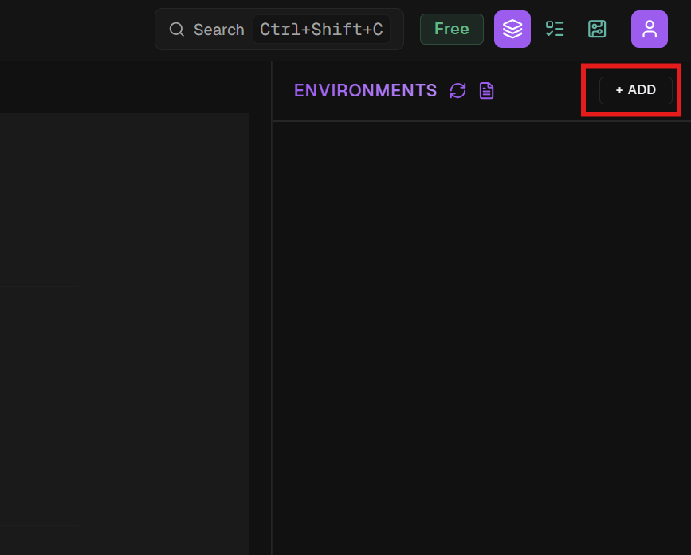

### Step 3. Find the Nanoacademic environment

Under **BROWSE ENVIRONMENTS**, type `nanoacademic` into the search box. **Nanoacademic** appears under **SHARED ENVIRONMENTS**. Select it.

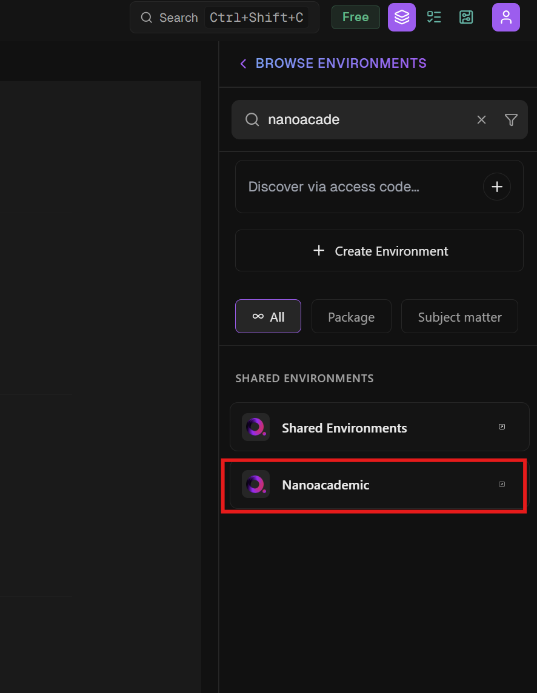


### Step 4. Install it

Leave **Platform** on **Linux**, confirm the **Latest** tag, and click **Install**. This single environment carries RESCU, NanoDCAL, and LatticeMind, together with around a hundred supporting Python packages on Python 3.12.

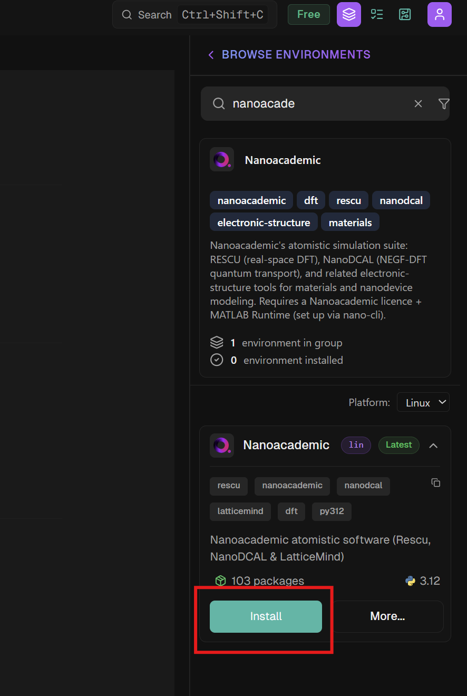

The install runs in the background and takes a few minutes. Feel free to keep working; the panel tracks progress and marks the environment as installed when it finishes.

### Step 5. Open a notebook on the Nanoacademic kernel

Go back to the **Launcher** tab. Under **NOTEBOOK** there is now a **Python 3 [nanoacademic]** kernel. Click it to open a notebook backed by the environment you just installed.

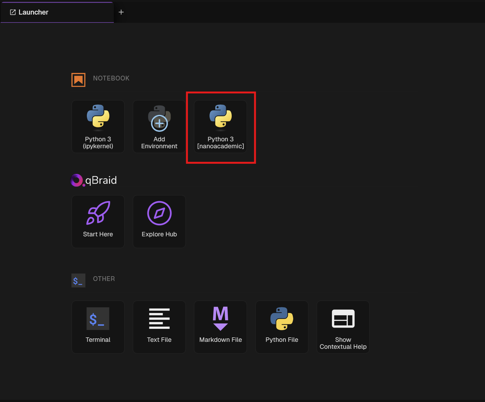

If the kernel is not there yet, the install is most likely still finishing. Give it a moment and reload the page.

### Step 6. Confirm you are on the right kernel

A quick sanity check saves confusion later. Run this in the first cell:

```python
import sys
print(sys.executable)
```

You should see a path inside the Nanoacademic environment, along the lines of:

```
/home/jovyan/.qbraid/environments/nanoac_n7w1/pyenv/bin/python
```

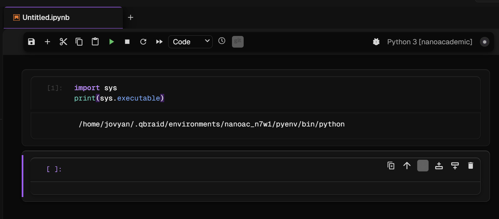

The `nanoac_n7w1` piece is a short identifier unique to your installation, so yours will differ. Keep the path nearby, as the next step uses it.

### Step 7. Activate the environment in a terminal

RESCU, NanoDCAL, LatticeMind, and the `nano-cli` license tool are command-line programs, so the remaining setup happens in a terminal. Open one from the Launcher, under **OTHER → Terminal**, then activate the environment:

```bash
source ~/.qbraid/environments/nanoac_*/pyenv/bin/activate
```

The `*` saves you from typing the identifier; you can also paste the full path from Step 6. Your prompt picks up a `(nanoacademic)` prefix, which is how you know the environment is active.

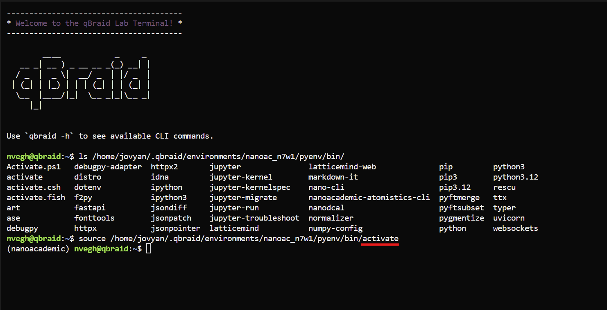

> A terminal does not remember this between sessions. Run the `source` command each time you open a new one, or add it to the end of your `~/.bashrc` if you would rather not think about it again.

### Step 8. Install the MATLAB Runtime

RESCU and NanoDCAL are compiled applications that need the MathWorks MATLAB Runtime R2020a. `nano-cli` fetches and installs it for you:

```bash
nano-cli runtime install
```

The runtime is about a 2.8 GB download and roughly 6 GB once installed, landing in `~/.local/share/nanoacademic/matlab-runtime`. It is licensed by MathWorks rather than by Nanoacademic, so you are asked to accept [their licence terms](https://www.mathworks.com/products/compiler/matlab-runtime.html) before anything is downloaded. Answer `y` to continue.

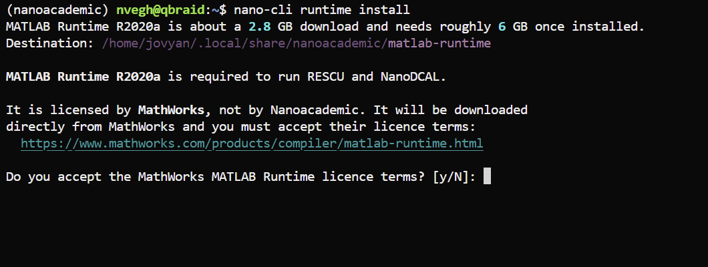

This is a one-time step for the Lab, and a good moment for a coffee. LatticeMind itself does not need the runtime, but the RESCU calculations it launches do.

### Step 9. Sign in and download your licenses

Run `nano-cli` with no arguments to open the interactive menu, choose **Login**, and enter the email and password for your [portal.nanoacademic.com](https://portal.nanoacademic.com/) account. Move around the menu with the arrow keys and select with Enter.

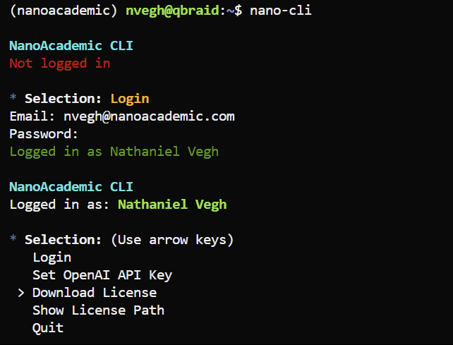

Once you are signed in, choose **Download License** and pick a product: **RESCU**, **NanoDCAL**, or **LatticeMind**. Repeat for each product you have licensed.

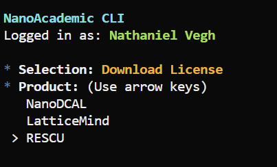

**Show License Path** will tell you where a license file was written, which is handy if you ever need to check or move one.

### Step 10. Add an OpenAI API key (optional, for LatticeMind)

This step matters only if you plan to use LatticeMind. From the same `nano-cli` menu, choose **Set OpenAI API Key** and paste your key at the prompt. It is stored for you, so this is a one-time task.

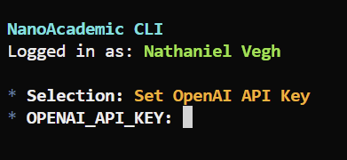

LatticeMind also works with Claude, Gemini, Qwen, and local models; see [Choosing an AI provider](#choosing-an-ai-provider) in the LatticeMind section if you would rather use one of those. RESCU and NanoDCAL need no AI provider at all, so you can skip this step entirely if LatticeMind is not part of your plans.

### Step 11. Check that RESCU runs

Back at the shell, with the environment still active, run `rescu` with no arguments. Seeing the help text means the binary, the MATLAB Runtime, and your license are all in place:

```bash
rescu
```

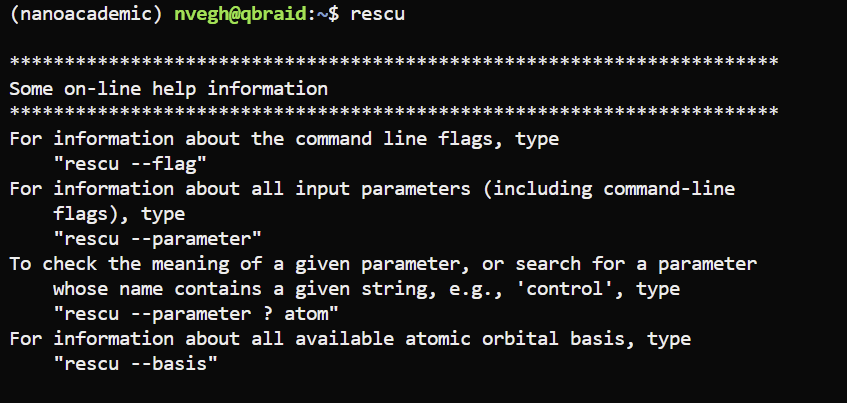

From here, `rescu --flag` lists the command-line flags, `rescu --parameter` lists every input parameter, `rescu --parameter ? atom` searches parameter names for a string, and `rescu --basis` shows the available atomic-orbital bases. `nanodcal` behaves the same way, so give it a try too if you licensed it.

### Step 12. Say hello to LatticeMind

If you licensed LatticeMind and set an API key, you are ready to start it. LatticeMind keeps each calculation in its own project folder and will politely decline to run directly in your home directory, so make a folder first:

```bash
mkdir -p ~/latticemind_projects/si_scf
cd ~/latticemind_projects/si_scf
latticemind
```

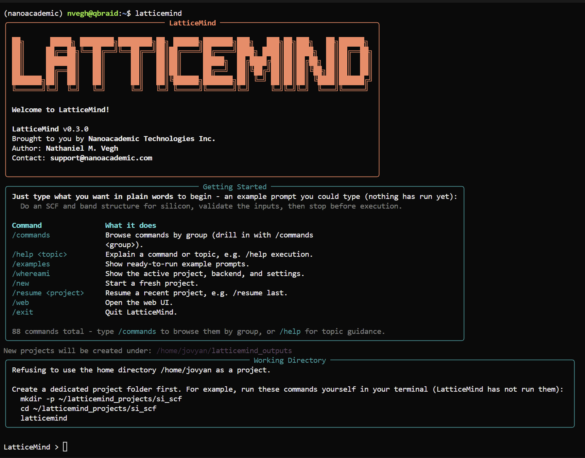

At the `LatticeMind >` prompt, simply describe what you want in plain language, for example:

> Do an SCF and band structure for silicon.

Type `/examples` for ready-to-run starter prompts, `/commands` to browse everything LatticeMind can do, or `/web` to open the web interface.

### You are all set

Your Lab now has all three products installed, licensed, and verified. Where to go next:

| If you want to | Go to |
| --- | --- |
| Run large-scale DFT on materials | [RESCU](#rescu) |
| Simulate quantum transport through a device | [NanoDCAL](#nanodcal) |
| Describe a calculation in plain language and let AI build it | [LatticeMind](#latticemind) |

A few things worth remembering:

- **Re-activate in each new terminal.** Every terminal needs the `source .../activate` command from Step 7.
- **The runtime and licenses persist.** Steps 8 through 10 are one-time per Lab, not per session.
- **Notebooks need the right kernel.** Use **Python 3 [nanoacademic]** rather than the default **Python 3 (ipykernel)**, or the Nanoacademic packages will not be importable.

Something not working as described? We are always glad to help at [support@nanoacademic.com](mailto:support@nanoacademic.com).

---

## Documentation

- [qBraid Docs](https://docs.qbraid.com/)
- [Nanoacademic Docs](https://docs.nanoacademic.com/)
- [RESCU Docs](https://docs.nanoacademic.com/rescu/)
- [NanoDCAL Docs](https://docs.nanoacademic.com/nanodcal/)
- [LatticeMind Docs](https://docs.nanoacademic.com/latticemind/)

## About Nanoacademic

Learn more about us on our website at [https://www.nanoacademic.com/](https://www.nanoacademic.com/)
